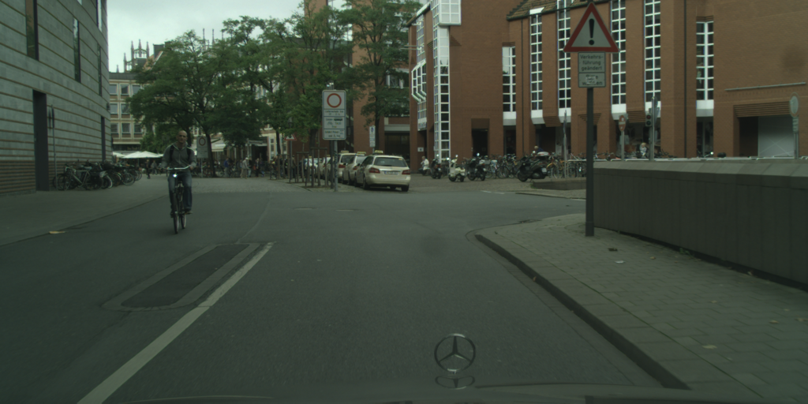
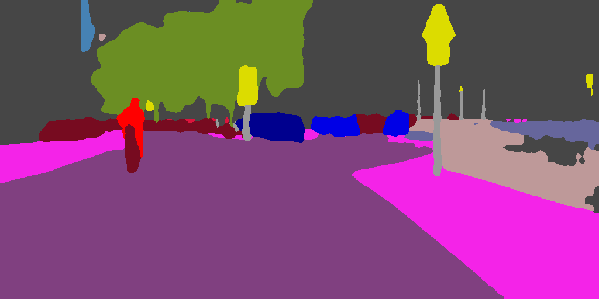
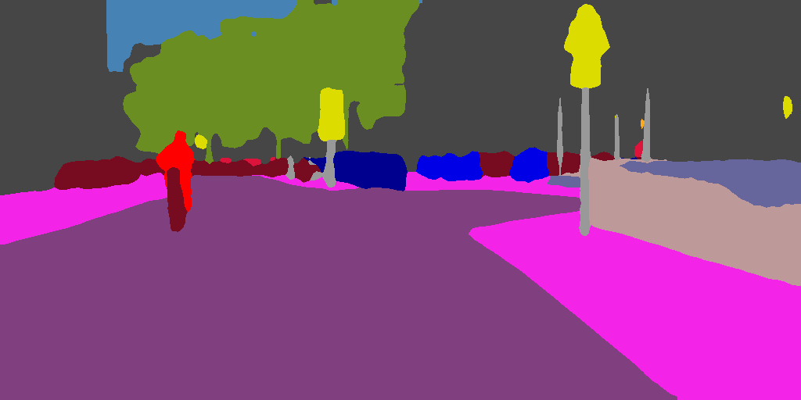

# MMSeg to LibTorch Examples 

- Convert mmseg pytorch model to torchscript mdoel. 
- Loading the torchscript model in C++.

## usage
1. Convert the mmsegmentation `pytorch model(.pth)` to `libtorch model(.pt)`
    - follow the install of [MMSegmetation](https://mmsegmentation.readthedocs.io/en/latest/get_started.html)
    - use the mmseg `tools/pytorch2torchscript.py` tool convert the pytorch `.pth` model to libtorch `.pt` model.
2. clone this repo and complie local.
    ``` bash
    git clone https://github.com/sshuair/mmseg-libtorch

    # compile 
    mkdir build && cd build
    cmake -D CMAKE_PREFIX_PATH=/path/to/libtorch -D CMAKE_PREFIX_PATH=/path/to/opencv ..
    make -j4

    # run the model 
    ./mmseg model.pt input_img.png output_result.png
    ```

## examples
1. PSPNet - cityscapes
   ``` bash
    # convert to libtorch .pt model
    cd /path/to/mmsegmentation
    python tools/pytorch2torchscript.py configs/pspnet/pspnet_r50-d8_512x1024_40k_cityscapes.py \
    --checkpoint checkpoints/pspnet_r50-d8_512x1024_40k_cityscapes_20200605_003338-2966598c.pth \
    --output-file checkpoints/pspnet_r50-d8_512x1024_40k_cityscapes_20200605_003338-2966598c.pt \
    --shape 512 1024
    
    # complie the mmseg use libtorch
    cd /path/to/mmseg-libtorch
    mkdir build && cd build
    cmake -D CMAKE_PREFIX_PATH=/path/to/libtorch -D CMAKE_PREFIX_PATH=/path/to/opencv ..
    make -j4

    # inference use c++ libtorch
   ./mmseg checkpoints/pspnet_r50-d8_512x1024_40k_cityscapes_20200605_003338-2966598c.pt \
    assets/cityscapes/munster_000059_000019_leftImg8bit_512x1024.png \
    munster_000059_000019_leftImg8bit_512x1024_result_pytorch.png.png

    # inference use python pytorch
    python pytorch_result.py --config configs/pspnet/pspnet_r50-d8_512x1024_40k_cityscapes.py \
    --checkpoint checkpoints/pspnet_r50-d8_512x1024_40k_cityscapes_20200605_003338-2966598c.pth \
    --imgfp assets/cityscapes/munster_000059_000019_leftImg8bit_512x1024.png \
    --output munster_000059_000019_leftImg8bit_512x1024_result_pytorch.png \
    --palette cityscapes
   ```
   
   | image                               | PyTorch result                      | LibTorch result                     |
   |-------------------------------------|-------------------------------------|-------------------------------------|
   |  |  |  |
   |                                     |                                     |                                     |


2. DeepLabV3+ - PascalVoc
   ```bash
    # convert to libtorch .pt model
    cd /path/to/mmsegmentation
    python tools/pytorch2torchscript.py configs/deeplabv3plus/deeplabv3plus_r50-d8_512x512_40k_voc12aug.py \
        --checkpoint checkpoints/deeplabv3plus_r50-d8_512x512_40k_voc12aug_20200613_161759-e1b43aa9.pth \
        --output-file checkpoints/deeplabv3plus_r50-d8_512x512_40k_voc12aug_20200613_161759-e1b43aa9.pt \
        --shape 500 334

    # inference use libtorch
   ./mmseg checkpoints/fcn_r101-d8_512x512_160k_ade20k_20200615_105816-fd192bd5.pt \
    assets/ADE/ADE_val_00000143.jp \
    ADE_val_00000143_result_pytorch.png
    ```

   | image                               | PyTorch result                      | LibTorch result                     |
   |-------------------------------------|-------------------------------------|-------------------------------------|
   |  |  |  |
   |                                     |                                     |                                     |

3. FCN - ADE
   ``` bash
    # convert to libtorch .pt model
    cd /path/to/mmsegmentation
   python tools/pytorch2torchscript.py configs/fcn/fcn_r101-d8_512x512_160k_ade20k.py \
    --checkpoint checkpoints/fcn_r101-d8_512x512_160k_ade20k_20200615_105816-fd192bd5.pth \
    --output-file checkpoints/fcn_r101-d8_512x512_160k_ade20k_20200615_105816-fd192bd5.pt \
    --shape 512 771
    
    # inference use libtorch
   ./mmseg checkpoints/fcn_r101-d8_512x512_160k_ade20k_20200615_105816-fd192bd5.pt \
    assets/ADE/ADE_val_00000143.jp \
    ADE_val_00000143_result_pytorch.png
   ```
   
   | image                               | PyTorch result                      | LibTorch result                     |
   |-------------------------------------|-------------------------------------|-------------------------------------|
   |  |  |  |
   |                                     |                                     |                                     |
